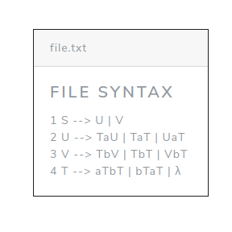

# CFG-Normal-Forms

> An algorithm that transforms any context free grammar to its Chomsky's normal form

## Installation & Run

```sh
npm install

npm start
```

## Usage example

Use one of the test files in ./test_files or a file ".txt" with the sintax that is specified below.



## Release History

- 0.0.1
  - Work in progress
  - First release

## Meta

David Aguilar – [@\_gdaguilar](https://twitter.com/_gdaguilar) – gd.aguilarc@gmail.com

Distributed under the GLP-3.0 license. See `LICENSE` for more information.

## Contributing

1. Fork it
2. Create your feature branch (`git checkout -b feature/fooBar`)
3. Commit your changes (`git commit -am 'Add some fooBar'`)
4. Push to the branch (`git push origin feature/fooBar`)
5. Create a new Pull Request
